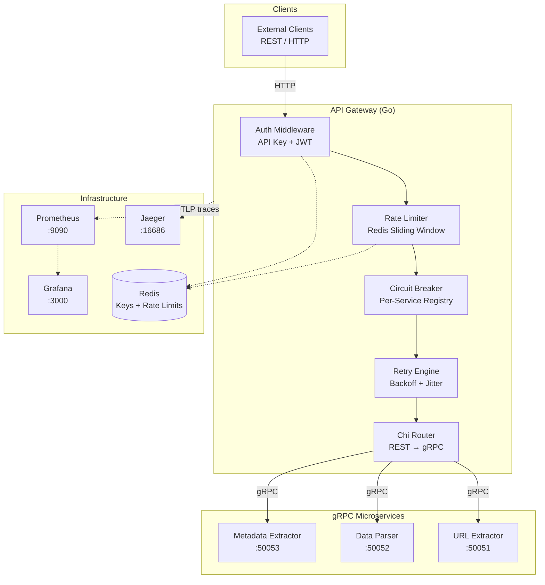

# Cloud-Native Microservices API Gateway

An enterprise-grade API gateway that sits between external clients and internal gRPC extractor microservices. It handles **dual authentication**, **Redis-backed sliding-window rate limiting**, **per-service circuit breaking**, **retry with exponential backoff**, **anti-loop protection**, and **full observability** — all in a single, production-ready Go binary.

Built as a portfolio showcase of cloud-native patterns: protocol translation (REST → gRPC), resilience engineering, and zero-trust API access.

---

## Architecture



### Request Lifecycle

1. **Ingress** — Client sends REST request with `X-API-Key` or `Authorization: Bearer` JWT
2. **Auth** — API key looked up in Redis (`apikey:{key}` → tenant, tier, scopes); JWT validated against shared secret
3. **Rate Limit** — Sliding-window counter per tenant/tier in Redis; `429` with `X-RateLimit-*` headers on exceed
4. **Circuit Breaker** — Per-extractor breaker checked; open circuits return `503` immediately
5. **gRPC Call** — Request translated to protobuf, forwarded with hop-count metadata (anti-loop)
6. **Retry** — Transient failures (`Unavailable`, `DeadlineExceeded`) retried with exponential backoff + jitter
7. **Response** — gRPC response marshaled to JSON; Prometheus metrics and Jaeger spans recorded

---

## Quick Start

### Prerequisites

- Docker & Docker Compose
- (Optional) [k6](https://k6.io/docs/get-started/installation/) for load testing

### 1. Start the Stack

```bash
cd deploy
docker compose up --build
```

Wait until all 8 containers are healthy (~30–60s on first build).

### 2. Seed API Keys

API keys are stored in Redis. Seed a demo key before making authenticated requests:

```bash
docker compose exec redis redis-cli HSET apikey:demo-key \
  tenant_id demo tier pro scopes extract

docker compose exec redis redis-cli HSET apikey:test-key-pro \
  tenant_id loadtest tier pro scopes extract
```

### 3. Verify Health

```bash
curl http://localhost:8080/api/v1/health
# {"status":"healthy","service":"api-gateway"}
```

### Services

| Service | URL | Credentials |
|---------|-----|-------------|
| API Gateway | http://localhost:8080 | API key or JWT |
| Grafana | http://localhost:3000 | admin / admin |
| Jaeger UI | http://localhost:16686 | — |
| Prometheus | http://localhost:9090 | — |
| Redis | localhost:6379 | — |

---

## Usage Examples

### Health Check (no auth)

```bash
curl http://localhost:8080/api/v1/health
```

### Prometheus Metrics (no auth)

```bash
curl http://localhost:8080/metrics
```

### Extract URL Content

```bash
curl -X POST http://localhost:8080/api/v1/extract/url \
  -H "Content-Type: application/json" \
  -H "X-API-Key: demo-key" \
  -d '{
    "url": "https://example.com",
    "include_links": true,
    "include_images": false,
    "max_depth": 1
  }'
```

### Parse Structured Data

```bash
curl -X POST http://localhost:8080/api/v1/extract/data \
  -H "Content-Type: application/json" \
  -H "X-API-Key: demo-key" \
  -d '{
    "content": "{\"name\": \"test\", \"value\": 42}",
    "schema_hint": "json"
  }'
```

### Extract Metadata

```bash
curl -X POST http://localhost:8080/api/v1/extract/metadata \
  -H "Content-Type: application/json" \
  -H "X-API-Key: demo-key" \
  -d '{
    "url": "https://example.com",
    "metadata_types": ["opengraph", "headers", "dns"]
  }'
```

### JWT Authentication

Generate a token signed with `JWT_SECRET` (default: `demo-secret-change-me` in docker-compose):

```bash
# Example payload: {"tenant_id":"user-1","scopes":["extract"]}
curl -X POST http://localhost:8080/api/v1/extract/data \
  -H "Content-Type: application/json" \
  -H "Authorization: Bearer <your-jwt>" \
  -d '{"content": "hello world", "schema_hint": "text"}'
```

JWT-authenticated requests use the `jwt` tier for rate limiting (defaults to free-tier limits).

---

## Authentication

| Method | Header | Use Case |
|--------|--------|----------|
| API Key | `X-API-Key: <key>` | Service-to-service, tenant-scoped access |
| JWT | `Authorization: Bearer <token>` | User-scoped operations |

API keys are stored in Redis as hashes:

```
apikey:{key} → { tenant_id, tier, scopes }
```

### Rate Limit Tiers

| Tier | Requests/min | Burst/sec | Typical Use |
|------|-------------|-----------|-------------|
| `free` | 100 | 10 | Development, JWT users |
| `pro` | 1,000 | 50 | Production API keys |
| `enterprise` | 10,000 | 500 | High-volume tenants |

Rate limit headers on every authenticated response:

```
X-RateLimit-Limit: 1000
X-RateLimit-Remaining: 987
X-RateLimit-Reset: 1690000060
```

---

## Performance

| Metric | Target | Notes |
|--------|--------|-------|
| Throughput | 10,000+ req/sec | Gateway overhead only; extractor latency excluded |
| P50 Latency | < 5 ms | Auth + rate limit + routing |
| P95 Latency | < 12 ms | Under normal load |
| P99 Latency | < 20 ms | With circuit breaker active |
| Error Rate | < 0.1% | Excluding intentional extractor failures |

*Aspirational targets measured on 4-core / 8 GB RAM, docker-compose stack, k6 load test.*

### Run Load Tests

Full ramp (100 → 500 → 1000 VUs over ~2.5 min):

```bash
make loadtest
```

Quick smoke test (50 VUs, 30s):

```bash
make loadtest-quick
```

Override target and API key:

```bash
k6 run --env BASE_URL=http://localhost:8080 --env API_KEY=demo-key loadtest/gateway.js
```

---

## Key Features

| Feature | Description |
|---------|-------------|
| **Dual Authentication** | API key (Redis-backed) + JWT (HMAC-SHA256) with tenant isolation |
| **Sliding Window Rate Limiting** | Redis sorted-set counters, per-tenant, tier-aware |
| **Circuit Breaker** | Per-service registry with closed → open → half-open state machine |
| **Retry with Backoff** | Exponential backoff + jitter on transient gRPC errors only |
| **Anti-Loop Protection** | `X-Gateway-Hop-Count` metadata prevents circular service calls |
| **Full Observability** | Prometheus metrics, Grafana dashboards, Jaeger distributed tracing |
| **Protocol Translation** | REST/JSON ↔ gRPC/Protobuf with automatic marshaling |

---

## Configuration

| Variable | Default | Description |
|----------|---------|-------------|
| `PORT` | `8080` | Gateway HTTP listen port |
| `REDIS_URL` | `redis://localhost:6379` | Redis connection URL |
| `JWT_SECRET` | `dev-secret-change-in-production` | HMAC secret for JWT validation |
| `EXTRACTOR_URL_ADDR` | `localhost:50051` | URL extractor gRPC address |
| `EXTRACTOR_DATA_ADDR` | `localhost:50052` | Data parser gRPC address |
| `EXTRACTOR_META_ADDR` | `localhost:50053` | Metadata extractor gRPC address |
| `CIRCUIT_BREAKER_TIMEOUT_SEC` | `30` | Duration circuit stays open before half-open probe |
| `CIRCUIT_BREAKER_THRESHOLD` | `5` | Consecutive failures before circuit opens |
| `RETRY_MAX_ATTEMPTS` | `3` | Max retry attempts for transient gRPC errors |
| `RETRY_BASE_DELAY_MS` | `100` | Base delay for exponential backoff (ms) |
| `REQUEST_TIMEOUT_SEC` | `5` | Per-attempt gRPC call timeout (seconds) |
| `JAEGER_ENDPOINT` | `http://localhost:4318` | OTLP HTTP trace exporter endpoint |
| `OTEL_ENABLED` | `true` | Enable OpenTelemetry tracing |
| `FAILURE_RATE` | `0` | Simulated extractor failure rate (0.0–1.0, extractor services only) |

---

## Kubernetes Deployment

Helm charts are provided under `deploy/helm/` for production deployment.

```bash
# Infrastructure (Redis)
helm install infra deploy/helm/infrastructure/

# Extractor microservices
helm install extractors deploy/helm/extractors/

# API Gateway (with HPA, Ingress, ConfigMap)
helm install gateway deploy/helm/api-gateway/
```

### Gateway Helm Features

- **HPA**: 2–10 replicas, 70% CPU target
- **Ingress**: nginx class, configurable host
- **ConfigMap**: All gateway env vars externalized
- **Resources**: 100m/128Mi requests, 500m/256Mi limits

Verify deployment:

```bash
kubectl get pods -l app.kubernetes.io/name=api-gateway
curl http://gateway.local/api/v1/health
```

---

## Tech Stack

| Layer | Technology |
|-------|------------|
| Language | Go 1.22+ |
| HTTP Router | [chi](https://github.com/go-chi/chi) v5 |
| RPC | gRPC + Protocol Buffers (buf) |
| Cache / Rate Limits | Redis 7 ([go-redis](https://github.com/redis/go-redis)) |
| Auth | JWT ([golang-jwt](https://github.com/golang-jwt/jwt)) + Redis API keys |
| Metrics | Prometheus ([client_golang](https://github.com/prometheus/client_golang)) |
| Dashboards | Grafana 10 |
| Tracing | OpenTelemetry → Jaeger |
| Containers | Docker multi-stage builds (Alpine) |
| Orchestration | Helm 3 |
| Load Testing | k6 |

---

## Project Structure

```
.
├── cmd/
│   ├── gateway/              # Gateway entrypoint
│   ├── extractor-url/        # URL content extractor service
│   ├── extractor-data/       # Structured data parser service
│   └── extractor-meta/       # Metadata extractor service
├── internal/
│   ├── gateway/
│   │   ├── config/           # Environment-based configuration
│   │   ├── middleware/       # Auth, rate limit, telemetry, request ID
│   │   ├── circuit/          # Per-service circuit breaker registry
│   │   └── router/           # REST → gRPC route handlers + retry
│   ├── extractor/
│   │   ├── url/              # URL extraction gRPC service
│   │   ├── data/             # Data parsing gRPC service
│   │   └── meta/             # Metadata extraction gRPC service
│   └── pkg/
│       ├── redis/            # Redis client (rate limits + API keys)
│       ├── telemetry/        # OpenTelemetry tracer + Prometheus metrics
│       └── response/         # Standardized JSON error/success responses
├── proto/
│   └── extractor/v1/         # Protobuf service definitions
├── gen/                      # Generated protobuf + gRPC code
├── deploy/
│   ├── docker/               # Multi-stage Dockerfiles
│   ├── docker-compose.yml    # Full 8-service local stack
│   ├── prometheus.yml        # Scrape configuration
│   ├── grafana/              # Dashboards + datasource provisioning
│   └── helm/                 # Kubernetes Helm charts
│       ├── api-gateway/      # Gateway deployment + HPA + ingress
│       ├── extractors/       # All three extractor services
│       └── infrastructure/   # Redis
├── loadtest/
│   └── gateway.js            # k6 load test script
├── Makefile                  # Build, test, proto, loadtest targets
└── go.mod
```

---

## Development

```bash
# Generate protobuf code
make proto

# Run tests (with race detector)
make test

# Build all binaries
make build

# Run gateway locally (requires Redis + extractors)
make run-gateway
```

---

## API Endpoints

| Method | Path | Auth | Description |
|--------|------|------|-------------|
| `GET` | `/api/v1/health` | No | Health check |
| `GET` | `/metrics` | No | Prometheus metrics |
| `POST` | `/api/v1/extract/url` | Yes | Extract content from URL |
| `POST` | `/api/v1/extract/data` | Yes | Parse structured data |
| `POST` | `/api/v1/extract/metadata` | Yes | Extract page metadata |

---

## License

MIT
